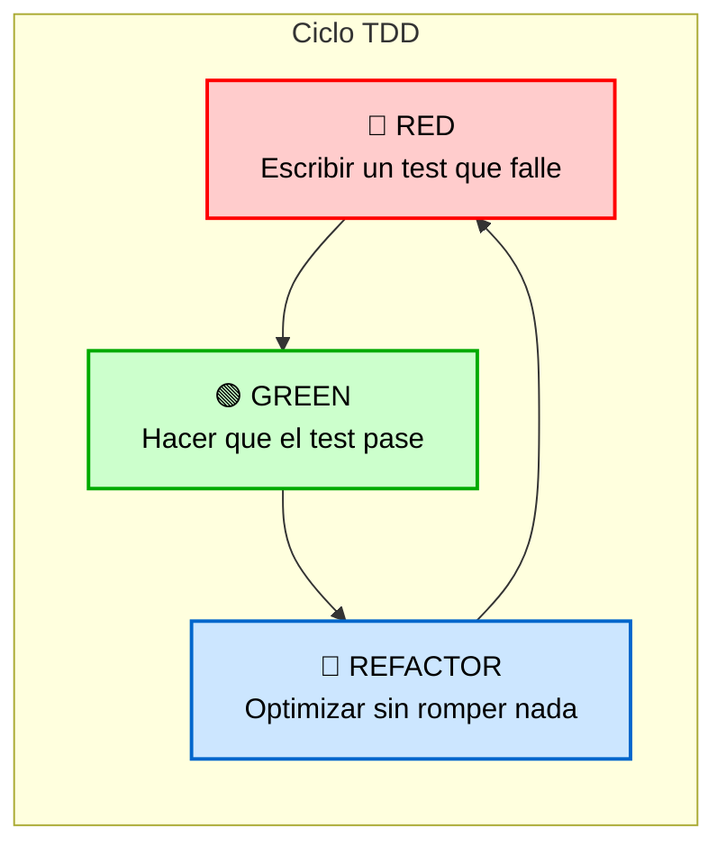

# 🏛️ Instituto Web App - Sistema de Gestión Unificado
## 🛠️ Especificación Técnica: SOLID Principles & Test-Driven Development (TDD)

Este repositorio contiene la aplicación web de una sola página (SPA) para la gestión integral del instituto (servicios para estudiantes, profesores y personal administrativo). El desarrollo se rige estrictamente bajo los principios de diseño **SOLID** y la metodología **TDD (Desarrollo Guiado por Pruebas)** para garantizar un software mantenible, escalable y libre de errores.

---

## 🧩 1. Arquitectura Basada en Principios SOLID

Para evitar que la aplicación se convierta en un bloque de código rígido y acoplado, cada componente y caso de uso se diseña siguiendo los cinco principios SOLID:

### 🔴 S - Single Responsibility Principle (Responsabilidad Única)
* **El Enfoque:** Un módulo o clase debe responder a un único actor o fuente de cambio.
* **En el Instituto:** Separamos las acciones por actor (**Aspirantes, Estudiantes, Profesores, Administrativos**). El caso de uso `RegistrarCalificaciones` pertenece exclusivamente al flujo del Profesor. Si el personal administrativo cambia las reglas de inscripción, el módulo del profesor permanece intacto y protegido.

### 🟢 O - Open/Closed Principle (Abierto/Cerrado)
* **El Enfoque:** El código debe estar abierto a la extensión, pero cerrado a la modificación.
* **En el Instituto:** Si el instituto decide cambiar el formato de evaluación (ej. pasar de notas numéricas 1-20 a letras A-F), no modificamos el núcleo del sistema. Diseñamos una interfaz de cálculo de notas y extendemos el comportamiento creando una nueva estrategia de calificación.

### 🔵 L - Liskov Substitution Principle (Sustitución de Liskov)
* **El Enfoque:** Las subclases deben poder sustituir a sus clases base sin alterar el comportamiento correcto del sistema.
* **En el Instituto:** La clase base `Usuario` define el comportamiento común (nombre, correo, ID). Las subclases `Estudiante` y `Profesor` heredan de ella. Cualquier vista o componente de la UI que requiera mostrar datos de un `Usuario` (como la barra de perfil) funcionará perfectamente sin importar qué rol específico tenga el objeto.

### 🟡 I - Interface Segregation Principle (Segregación de Interfaces)
* **El Enfoque:** Es preferible tener muchas interfaces específicas que una sola interfaz gigante.
* **En el Instituto:** En lugar de crear un único contrato masivo para la base de datos, segregamos las interfaces en repositorios específicos: `StudentRepository` (gestión de matrículas y récord académico) y `TeacherRepository` (carga de notas y secciones). Cada módulo solo implementa y ve lo que realmente necesita.

### 🟣 D - Dependency Inversion Principle (Inversión de Dependencias)
* **El Enfoque:** Los módulos de alto nivel (reglas de negocio) no deben depender de módulos de bajo nivel (UI, frameworks, bases de datos). Ambos dependen de abstracciones.
* **En el Instituto:** El corazón de la aplicación (los Casos de Uso) no sabe ni le importa si los datos se guardan en PostgreSQL, MariaDB o en el LocalStorage del navegador. El caso de uso depende de una *interfaz*. La base de datos real se convierte en un simple detalle de infraestructura que se adapta al núcleo.

---

## 🧪 2. Ciclo de Desarrollo TDD (Red - Green - Refactor)

Ninguna funcionalidad de esta aplicación se escribe sin antes tener una prueba automatizada que valide su comportamiento. Implementamos el ciclo estricto de TDD:

Importancia para la Evaluación: Este documento constituye el pilar fundamental para la defensa teórica y práctica de tu calificación individual. En el desarrollo de software moderno, el código fuente por sí solo no refleja el proceso de toma de decisiones; este archivo evidencia formalmente ante el cuerpo docente que la estructura del sistema no es accidental, sino el resultado de aplicar criterios de ingeniería rigurosos, garantizando que comprendes la teoría de diseño limpio y sabes cómo implementarla bajo presión académica.

Integrantes: 
Xamuel Romero   
Alan Mendoza y
Angel Colmenares
